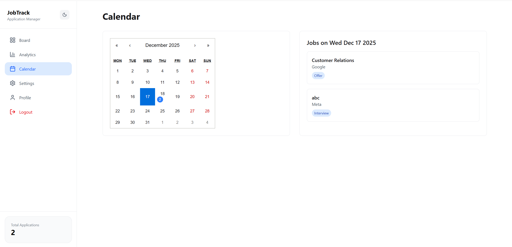
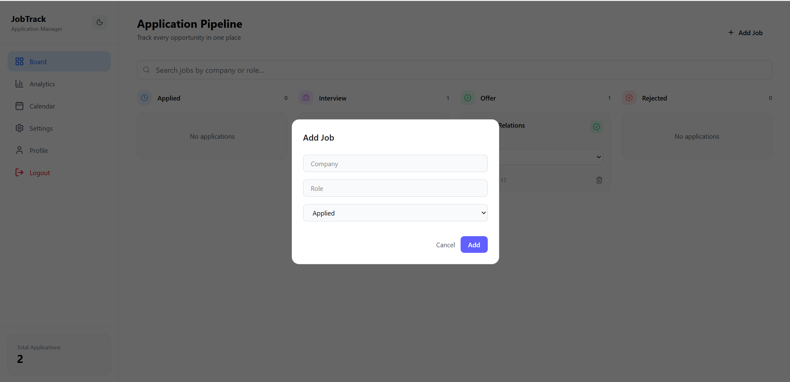

# JobTrack Pro – Frontend Job Application Tracker 🚀

JobTrack Pro is a modern, frontend-focused job application tracking platform built using **React, TypeScript, and Tailwind CSS**.  
It helps users visually manage their job applications across different stages using a Kanban-style board, analytics, calendar views, and a clean SaaS-inspired UI.

## 🚀 Deployment

The application is deployed on **Vercel**.

🔗 Live URL: [https://jobtrack-pro.vercel.app](https://jobtrack-pro-sand.vercel.app/login)

### Deployment Highlights
- Automatic CI/CD via GitHub
- Optimized production build
- Client-side routing handled correctly

---
## 📸 Screenshots

### 🧩 Job Board (Kanban View)

### 📊 Analytics Dashboard

### 🗓 Calendar View

### 🌗 Dark / Light Mode

### ➕ Add Job Modal

## ✨ Features

### 📌 Core Functionality
- Kanban Board with job statuses: **Applied, Interview, Offer, Rejected**
- Add, update, and delete job applications
- Drag-and-drop jobs between columns
- Real-time status updates

### 🔍 Productivity Tools
- Search and filter jobs by company or role
- Calendar view to track application dates
- Analytics dashboard with charts (status distribution, monthly activity)

### 🎨 UI & UX
- Dark / Light theme toggle
- Premium SaaS-style design inspired by **Apple / Framer**
- Sidebar-based layout with sticky top bar
- Responsive and accessible UI

### 🔐 Authentication (Frontend Mock)
- Login / Signup / Logout flow
- AuthContext with mock auth token
- Protected routes for authenticated pages

---

## 🛠️ Tech Stack

- **React (with Hooks)**
- **TypeScript**
- **Tailwind CSS (v4)**
- **Context API**
- **@dnd-kit** – drag and drop
- **Recharts** – analytics charts
- **Lucide Icons**
- **Vite**

---

## 📂 Project Structure

